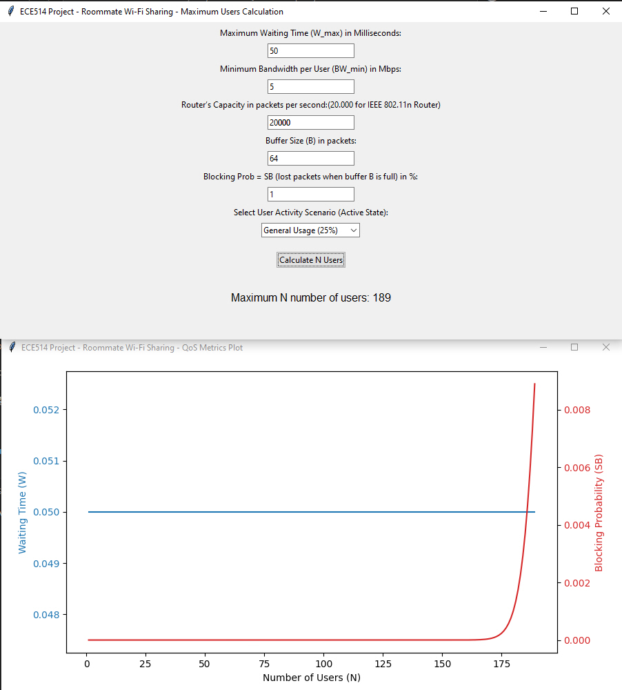

# Python WiFi QoS Users Capacity Estimator

[](https://www.python.org/)
[](https://en.wikipedia.org/wiki/IEEE_802.11n-2009)
[](LICENSE)

## Overview

**Python WiFi QoS UsersCapacity Estimator** is an interactive tool to calculate the maximum number of users that can share a WiFi (IEEE 802.11a/b/g/n) router while maintaining acceptable Quality of Service (QoS). The tool leverages queuing theory (M/M/1/B) and Markov models to evaluate how user activity patterns and router parameters affect network performance.

- **Estimate router capacity in real scenarios:**  
  Analyze how many roommates or users can share a WiFi router for different activities (browsing, streaming, gaming, etc.) without degrading user experience.

- **Powered by Python:**  
  Modern GUI (Tkinter) and real-time charts (matplotlib).

## Key Features

- User-friendly graphical interface
- Configurable parameters (bandwidth, buffer, router capacity, QoS thresholds, user activity)
- Supports various real-world scenarios and activity profiles
- Automated performance analysis with visual plots
- Flexible and ready for academic or practical use

## How It Works

The tool models user behavior using a Markov chain (active/idle states) and network congestion using the M/M/1/B queuing model. It computes:
- **Blocking Probability (SB):** Likelihood of packet loss due to full buffer
- **Average Waiting Time (W):** Network delay per packet

An iterative simulation determines the maximum number of users that meet selected QoS constraints.

---

## Usage

### 1. **Install Requirements**
Python 3.8+ recommended.

```bash
pip install matplotlib
```

*Tkinter is included by default in standard Python distributions.*

### 2. **Clone this Repository**
```bash
git clone https://github.com/yourusername/Python-Wifi-QoS-UsersCapacity-Estimator.git
cd Python-Wifi-QoS-UsersCapacity-Estimator
```

### 3. **Run the App**
```bash
python users_capacity_estimator.py
```

### 4. **Set Your Parameters**
- **Maximum Waiting Time (W_max)** in milliseconds (e.g., `50`)
- **Minimum Bandwidth per User (BW_min)** in Mbps (e.g., `5`)
- **Router Capacity** in packets/sec (e.g., `20000` for IEEE 802.11n)
- **Buffer Size (B)** in packets (e.g., `64`)
- **Blocking Probability SB (max packet loss %)** (e.g., `1`)
- **User Activity Scenario**: Select from General Usage, Web Browsing, Gaming, or Video Streaming

### 5. **Interpret the Results**
- The GUI displays the **maximum number of users** supported under your settings.
- A plot window shows **Waiting Time** and **Blocking Probability** versus the number of users.

---

## Example

**Scenario:**  
- Want to know how many users can share a WiFi router (IEEE 802.11n, 240 Mbps) with max 1% packet loss and max 50ms delay.

**Input Parameters:**
- Maximum Waiting Time: `50`
- Minimum Bandwidth per User: `5`
- Router’s Capacity: `20000`
- Buffer Size: `64`
- Blocking Probability: `1`
- User Activity: `General Usage (25%)`

**Result:**  



---

## Technical Details

- **Python GUI:** Tkinter
- **Plotting:** matplotlib
- **Networking Models:** Markov chain (user behavior), M/M/1/B queuing
- **Customizable:** All network parameters, buffer size, activity patterns

### Main Python skills demonstrated:
- GUI programming with Tkinter
- Data visualization with matplotlib
- Algorithmic implementation of queuing theory and Markov processes
- Input validation, error handling, and modular code structure

---

## License

MIT License.

---

## Author

**Gabriel Naranjo Orozco**  
MEng, University of Victoria, Department of Electrical and Computer Engineering  
[LinkedIn](https://linkedin.com/in/gabriel‐naranjo‐orozco)

---

*Feel free to fork, suggest improvements, or use this tool for your own academic or practical WiFi planning!*
